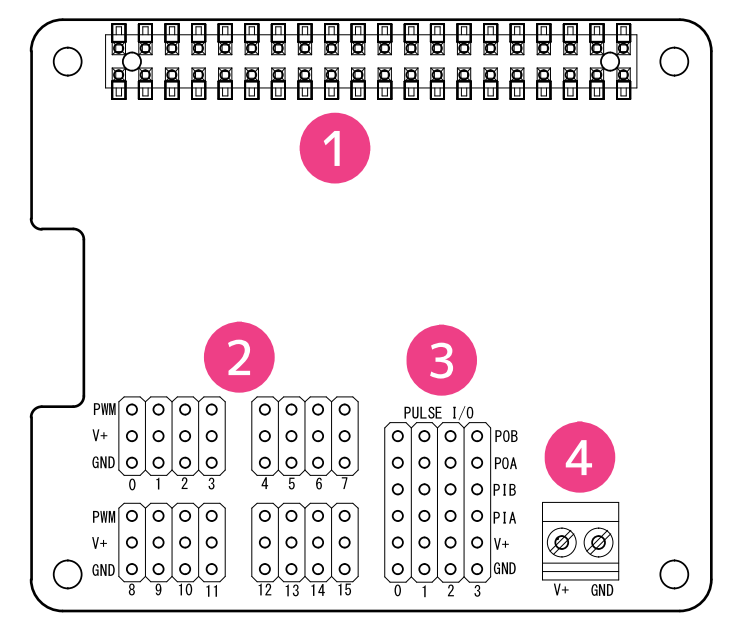
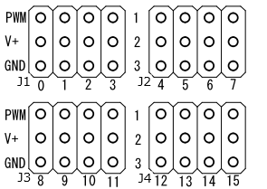
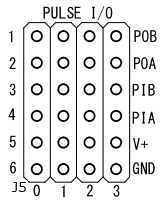
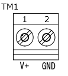

# RPi-GP90 各部名称と説明  
___  
## 1. 基板構成  
製品基板の各部名称は以下のとおりです。

  

| No | 名称 | 機能 |
|:-----:|:-----|-----|
|1|GPIO 40PINコネクタ|Raspberry Pi GPIO| 
|2|PWM出力 |PWM出力端子(ch0～ch15) |
|3|パルス入出力 |パルス入出力端子(ch0～ch3)|
|4|外部電源入力 |外部電源入力(ネジ端子) |

※外部電源入力(ネジ端子)の適合電線はAWG26～AWG16, ストリップ長は5mmです。
___  
## 2. 各端子・コネクタについて  
### 2-1. GPIO 40PINコネクタ
GPIO 40 PIN の配列および使用ピンは以下のとおりです。   
  

40PIN GPIOのピン配列と説明 

| PIN# | 信号名 | 説明 | PIN# | 信号名 | 説明 |
|:---:|:---|:---|:---:|:---|:---|
|1|3.3V|3.3V電源|2|5V|5V電源|
|3|I2C SDA1/GPIO 2|I2C SDA1|4|5V|5V電源|
|5|I2C SCL1/GPIO 3|I2C SCL1|6|GND|GND|
|7|GPIO 4|(未使用)|8|GPIO 14|(未使用)|
|9|GND|GND|10|GPIO 15|(未使用)|
|11|GPIO 17|(未使用)|12|GPIO 18|(未使用)|
|13|GPIO 27|絶縁電源制御|14|GND|GND|
|15|GPIO 22|(未使用)|16|GPIO 23|(未使用)|
|17|3.3V|3.3V電源|18|GPIO 24|(未使用)|
|19|SPI0 MOSI/GPIO 10|(未使用)|20|GND|GND|
|21|SPI0 MISO/GPIO 9|(未使用)|22|GPIO 25|(未使用)|
|23|SPI0 SCLK/GPIO 11|(未使用)|24|SPI CE0/GPIO 8|(未使用)|
|25|GND|GND|26|SPI CE1/GPIO 7|(未使用)|
|27|I2C SDA0/GPIO 0| HAT_ID読み込み用I2C |28|I2C SCL0/GPIO 1|HAT_ID読み込み用I2C|
|29|GPIO 5|(未使用)|30|GND|GND|
|31|GPIO 6|(未使用)|32|GPIO 12|(未使用)|
|33|GPIO 13|(未使用)|34|GND|GND|
|35|GPIO 19|(未使用)|36|GPIO 16|(未使用)|
|37|GPIO 26|(未使用)|38|GPIO 20|(未使用)|
|39|GND|GND|40|GPIO 21|(未使用)|  

### 2-2. PWM出力端子配列   
PWM出力端子配列は以下のとおりです。 

PWM出力 ピン配列と機能 

|J#-ch#|Pin1|Pin2|Pin3|Pin1機能|Pin2機能|Pin3機能|
|:---:|:---|:---|:---:|:---|:---|:---|
|J1-0|PWM0|V+|GND|PWM出力ch0|電源出力|GND|
|J1-1|PWM1|V+|GND|PWM出力ch1|電源出力|GND|
|J1-2|PWM2|V+|GND|PWM出力ch2|電源出力|GND|
|J1-3|PWM3|V+|GND|PWM出力ch3|電源出力|GND|
|J2-4|PWM4|V+|GND|PWM出力ch4|電源出力|GND|
|J2-5|PWM5|V+|GND|PWM出力ch5|電源出力|GND|
|J2-6|PWM6|V+|GND|PWM出力ch6|電源出力|GND|
|J2-7|PWM7|V+|GND|PWM出力ch7|電源出力|GND|
|J3-8|PWM8|V+|GND|PWM出力ch8|電源出力|GND|
|J3-9|PWM9|V+|GND|PWM出力ch9|電源出力|GND|
|J3-10|PWM10|V+|GND|PWM出力ch10|電源出力|GND|
|J3-11|PWM11|V+|GND|PWM出力ch11|電源出力|GND|
|J4-12|PWM12|V+|GND|PWM出力ch12|電源出力|GND|
|J4-13|PWM13|V+|GND|PWM出力ch13|電源出力|GND|
|J4-14|PWM14|V+|GND|PWM出力ch14|電源出力|GND|
|J4-15|PWM15|V+|GND|PWM出力ch15|電源出力|GND|

### 2-3. パルス入出力端子配列   
パルス入出力端子配列は以下のとおりです。 

パルス入出力 ピン配列と機能 

|J#-ch#|Pin1|Pin2|Pin3|Pin4|Pin5|Pin6|Pin1機能|Pin2機能|Pin3機能|Pin4機能|Pin5機能|Pin6機能|
|:---:|:---|:---|:---|:---|:---|:---:|:---|:---|:---|:---|:---|:---|
|J5-0|POB0|POA0|PIB0|PIA0|V+|GND|パルス出力B ch0|パルス出力A ch0|パルス入力B ch0|パルス入力A ch0|電源出力|GND|
|J5-1|POB1|POA1|PIB1|PIA1|V+|GND|パルス出力B ch1|パルス出力A ch1|パルス入力B ch1|パルス入力A ch1|電源出力|GND|
|J5-2|POB2|POA2|PIB2|PIA2|V+|GND|パルス出力B ch2|パルス出力A ch2|パルス入力B ch2|パルス入力A ch2|電源出力|GND|
|J5-3|POB3|POA3|PIB3|PIA3|V+|GND|パルス出力B ch3|パルス出力A ch3|パルス入力B ch3|パルス入力A ch3|電源出力|GND|

### 2-4. 外部電源入力端子配列   
外部電源入力端子配列は以下のとおりです。 

|TM#-Pin#|信号名|機能|
|:---:|:---|:---|
|TM1-1|V+|外部電源入力（５V±10%）|
|TM1-2|GND|外部電源GND|

___  

