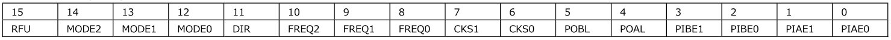

# RPi-GP90の機能と説明  
各インターフェースについて説明します。ブロック図は以下の通りです。  

  

___  
## 1. インターフェース  
### 1-1. Rapsberry Pi GPIO 40pin  
RPi-GP90を制御するために、GPIO 40pinの下記の信号を使用します。  
  
<u>制御信号</u>  
  
| PIN# | 名称 | 機能説明 |  
|:---:|:---|:---|  
|3|I2C SDA1|PWMコントローラ/パルスコントローラ用I2C|  
|5|I2C SCL1|PWMコントローラ/パルスコントローラ用I2C|  
|13|GPIO27|絶縁電源制御出力  1:ON / 0:OFF|  
|27|GPIO0/ID_SD|HAT_ID読み込み用I2C|  
|28|GPIO1/ID_SC|HAT_ID読み込み用I2C|  

<u>電源端子</u>  
  
|PIN#|説明|  
|:--:|:--:|  
|1pin 17pin|3.3V|  
|2pin 4pin|5V|  
|6pin 9pin 14pin 20pin 25pin 30pin 34pin 39pin|GND|  
  
### 1-2. I2Cアドレス  
PWMコントローラおよびパルスコントローラを制御するためのI2Cアドレスは以下のとおりです。  

<u>PWMコントローラ(PCA9685)</u>  
基板上の半田ジャンパでPWMコントローラ(PCA9685)のI2Cアドレス設定変更が可能です。  
出荷時のI2Cアドレス(7bit)は`0x40`に設定されています。  
設定変更方法については[RPi-GP90の設定と装着](../setup/README.md)を参照してください。  

<u>パルスコントローラ(ARMマイコン STM32F)</u>  
出荷時のI2Cアドレス(7bit)は`0x30`に設定されています。  

### 1-3. PWM出力  
PWM出力部は下図のような回路構成です。  
  
- PWM0-15: PWM出力チャンネル0-15  
 > オープンドレイン/トーテムポール設定が可能です。  
 > 出力特性は以下のとおりです。  
 > 最大電流（ON:‘L’出力時シンク電流）25mA/ch, 16ch合計最大400mA  
 > 最大電流（‘H’出力時ソース電流）10mA/ch, 16ch合計最大20mA  
 > 最大耐圧（OFF:オープン時）5.5V  
- V+: 電源出力  
 > 外部電源入力[TM1]から入力された5Vを出力します。  
- GND: 電源GND  
 > 絶縁電源GNDに接続されます。  

### 1-4. パルス出力  
パルス出力部は下図のような回路構成です。  
   
- POA0-3,POB0-3: パルス出力チャンネル0-3  
 > DMOSオープンドレイン出力方式です。  
 > 10kΩでV＋へプルアップされています。  
 > 出力特性は以下のとおりです。  
 > 最大電流（ON:‘L’出力時シンク電流）100mA/本, 8本合計最大400mA  
 > 最大耐圧（OFF:オープン時）5.5V  
 > 標準ON抵抗2Ω  
- V+: 電源出力  
 > 外部電源入力[TM1]から入力された5Vを出力します。  
- GND: 電源GND  
 > 絶縁電源GNDに接続されます。  

### 1-5. パルス入力  
パルス入力部は下図のような回路構成です。  
  
- PIA0-3,PIB0-3: パルス入力チャンネル0-3  
 > 高耐圧ダイオード方式です。  
 > ダイオードのアノード側は絶縁電源3.3Vへプルアップされています。  
 > 入力特性は以下のとおりです。  
 > VIH=Min2.3V/Max30V, VIL=Max1.0V  
- V+: 電源出力  
 > 外部電源入力[TM1]から入力された5Vを出力します。  
- GND: 電源GND  
 > 絶縁電源GNDに接続されます。  

### 1-6. 外部電源入力  
外部電源入力は、PWM出力のV＋端子や、パルス入出力のV+端子へ電源を供給します。  
入力電圧は５V（±10%）です。  
下図のような回路構成で、逆極性接続保護用のP-ch MOSFETが付いています。  
  

## 2. PWMコントローラ  
PWMコントローラとして、NXP社PCA9685を使用しています。  
I2Cアドレス(7bit)の初期値は`0x40`で、基板上のハンダジャンパで`0x40～0x4F`の設定が可能です。  

### 2-1. PCA9685レジスタマップ  
PCA9685のレジスタマップは以下のとおりです。各レジスタの機能詳細については、NXP社のPCA9685データシートを参照してください。  

|レジスタアドレス|レジスタ機能|レジスタ名|  
|:---:|:---|:---|  
|00h,01h|モード|MODE1,　MODE2|  
|02h,03h,04h|I2Cサブアドレス|SUBADR1,　SUBADR2,　SUBADR3|  
|05h|I2C All Callアドレス|ALLCALLADR|  
|06h,07h,08h,09h|LED0コントロール|LED0_ON_L, LED0_ON_H, LED0_OFF_L, LED0_OFF_H|  
|0Ah,0Bh,0Ch,0Dh|LED1コントロール|LED1_ON_L, LED1_ON_H, LED1_OFF_L, LED1_OFF_H|  
|0Eh,0Fh,10h,11h|LED2コントロール|LED2_ON_L, LED2_ON_H, LED2_OFF_L, LED2_OFF_H|  
|12h,13h,14h,15h|LED3コントロール|LED3_ON_L, LED3_ON_H, LED3_OFF_L, LED3_OFF_H|  
|16h,17h,18h,19h|LED4コントロール|LED4_ON_L, LED4_ON_H, LED4_OFF_L, LED4_OFF_H|  
|1Ah,1Bh,1Ch,1Dh|LED5コントロール|LED5_ON_L, LED5_ON_H, LED5_OFF_L, LED5_OFF_H|  
|1Eh,1Fh,20h,21h|LED6コントロール|LED6_ON_L, LED6_ON_H, LED6_OFF_L, LED6_OFF_H|  
|22h,23h,24h,25h|LED7コントロール|LED7_ON_L, LED7_ON_H, LED7_OFF_L, LED7_OFF_H|  
|26h,27h,28h,29h|LED8コントロール|LED8_ON_L, LED8_ON_H, LED8_OFF_L, LED8_OFF_H|  
|2Ah,2Bh,2Ch,2Dh|LED9コントロール|LED9_ON_L, LED9_ON_H, LED9_OFF_L, LED9_OFF_H|  
|2Eh,2Fh,30h,31h|LED10コントロール|LED10_ON_L, LED10_ON_H, LED10_OFF_L, LED10_OFF_H|  
|32h,33h,34h,35h|LED11コントロール|LED11_ON_L, LED11_ON_H, LED11_OFF_L, LED11_OFF_H|  
|36h,37h,38h,39h|LED12コントロール|LED12_ON_L, LED12_ON_H, LED12_OFF_L, LED12_OFF_H|  
|3Ah,3Bh,3Ch,3Dh|LED13コントロール|LED13_ON_L, LED13_ON_H, LED13_OFF_L, LED13_OFF_H|  
|3Eh,3Fh,40h,41h|LED14コントロール|LED14_ON_L, LED14_ON_H, LED14_OFF_L, LED14_OFF_H|  
|42h,43h,44h,45h|LED15コントロール|LED15_ON_L, LED15_ON_H, LED15_OFF_L, LED15_OFF_H|  
| - | - | - |  
|FAh,FBh,FCh,FDh|ALL LEDコントロール|ALL_LED_ON_L, ALL_LED_ON_H, ALL_LED_OFF_L, ALL_LED_OFF_H|  
|FEh|プリスケール|PRE_SCALE|  
|FFh|テストモード|TESTMODE|  

## 3. パルスコントローラ  
パルス入出力コントローラとして、STMicro社ARMマイコンSTM32Fを使用しています。  
以下の８種類のパルス入出力機能をファームウェアへ組み込んでいます。  
パルス入力の分解能は50usです。50usより短いパルス信号は検知できません。  

|パルスモード|機能|   
|:---:|:---|  
|加算カウンタ|２つのパルス入力カウント値を加算します。 加算値がしきい値設定を超えたときに出力通知することも可能です。 パルス入力：PIAのカウント値とPIBのカウント値を加算する。 パルス出力：POAはコンペアAとのカウンタ絶対値比較結果を出力する。 　　　　　　POBはコンペアBとのカウンタ絶対値比較結果を出力する。|  
|減算カウンタ|２つのパルス入力カウント値の差分を得ます。 差分がしきい値設定を超えたときに出力通知することも可能です。 パルス入力：PIAのカウント値からPIBのカウント値を減算する。 パルス出力：POAはコンペアAとのカウンタ絶対値比較結果を出力する。 　　　　　　POBはコンペアBとのカウンタ絶対値比較結果を出力する。|  
|アップダウンカウンタ|パルス入力のカウント方向を入力端子で指定します。 しきい値設定を超えたときに出力通知することも可能です。 パルス入力：PIAの指定方向でPIBをカウントする。 パルス出力：POAはコンペアAとのカウンタ絶対値比較結果を出力しする。 　　　　　　POBはコンペアBとのカウンタ絶対値比較結果を出力する。|  
|位相カウンタ|ロータリーエンコーダのA相B相パルス信号をカウントします。 しきい値設定を超えたときの出力通知や、Z相でのカウント値リセットにも対応可能です。 パルス入力：PIAとPIBをA-B２相パルス信号としてカウントする。 　　　　　　カウンタリセット条件として、コンペアAとの一致やZ相パルス入力の指定も可能。 パルス出力：POAはコンペアAとのカウンタ絶対値比較結果を出力する。 　　　　　　POBはコンペアBとのカウンタ絶対値比較結果を出力する。|  
|周期測定|パルス入力の周期を測定します。 パルス入力：PIAの周期を内部クロックまたはPIBクロックで測定する。 パルス出力：POAは16bitカウンタのオーバーフローを出力する。 　　　　　　POBはコンペアBとのカウンタ絶対値比較結果を出力する。|  
|パルス幅測定|パルス入力のパルス幅を測定します。 パルス入力：PIAのHまたはLの期間を内部クロックまたはPIBクロックで測定する。 パルス出力：POAは16bitカウンタのオーバーフローを出力する。 　　　　　　POBはコンペアBとのカウンタ絶対値比較結果を出力する。|  
|ワンショット出力|トリガ入力から指定時間のワンショットパルスを出力します。 パルス入力：PIAのトリガで内部クロックまたはPIBクロックカウントを開始しする。 パルス出力：カウント開始でPOAを'H'出力する。コンペアAと一致したらPOAを'L'出力しカウンタをリセットする。 　　　　　　POBはコンペアBとのカウンタ絶対値比較結果を出力する。|  
|矩形波出力|指定周期で矩形波パルスを出力します。 パルス入力：内部クロックまたはPIBクロックカウントする。 パルス出力：コンペアAと一致したらPOAを反転出力しカウンタをリセットする。 　　　　　　POBはコンペアBとのカウンタ絶対値比較結果を出力する。|  

### 3-1. パルスコントローラI2C仕様  
パルスコントローラのI2C仕様は以下のとおりです。  
  

### 3-2. パルスコントローラレジスタマップ  
I2Cアドレス(7bit)は`0x30`です。  
レジスタマップは以下のとおりです。  

|レジスタアドレス|レジスタ機能|レジスタ名|R/W|  
|:---:|:---|:---|:---:|  
|00h,01h|ch0 コマンド|CMD0|R/W|  
|02h,03h|ch0 コンペアA/キャプチャ|CMPA0/CAP0|R/W|  
|04h,05h|ch0 コンペアB|CMPB0|R/W|  
|06h,07h|ch0 カウンタ|CNT1|R/W|  
|08h,09h|ch1 コマンド|CMD1|R/W|  
|0Ah,0Bh|ch1 コンペアA/キャプチャ|CMPA1/CAP1|R/W|  
|0Ch,0Dh|ch1 コンペアB|CMPB1|R/W|  
|0Eh,0Fh|ch1 カウンタ|CNT1|R/W|  
|10h,11h|ch2 コマンド|CMD2|R/W|  
|12h,13h|ch2 コンペアA/キャプチャ|CMPA2/CAP2|R/W|  
|14h,15h|ch2 コンペアB|CMPB2|R/W|  
|16h,17h|ch2 カウンタ|CNT2|R/W|  
|18h,19h|ch3 コマンド|CMD3|R/W|  
|1Ah,1Bh|ch3 コンペアA/キャプチャ|CMPA3/CAP3|R/W|  
|1Ch,1Dh|ch3 コンペアB|CMPB3|R/W|  
|1Eh,1Fh|ch3 カウンタ|CNT3|R/W|  
| - | - | - | - |  
|20h,21h|イベント(*1)|EVENT|R|  

I2Cでの16bitレジスタ読み込み動作：下位-上位の順に読み込む（下位読み込み時に16bit値の読み込みが実行され、上位値がホールドされる）  
I2Cでの16bitレジスタ書き込み動作：下位-上位の順に書き込む（下位ホールド後に上位書き込みで16bit値の書き込みが実行される）  
レジスタアドレスはByte読み込み/書き込み後に＋１されます。ただし、アドレス1Fhアクセス後は00hになります。  
(*1)イベントレジスタは読み込み専用です。  

### 3-3. パルスコントローラレジスタ詳細  
各レジスタの機能について  

- コマンドレジスタ (R/W) [CMD]　リセット初期値 0000h  
レジスタアドレス ch0:00h,01h ch1:08h,09h ch2:10h,11h ch3:18h,19h  
    
パルス入出力動作モードをchごとに指定します。  
　[RFU]: 予約  
　　　将来に予約  
　[MODE2,1,0]: 動作モード  
　　　0:加算カウンタ　1:減算カウンタ　2:アップダウンカウンタ　3:位相カウンタ　4:周期測定　5:パルス幅測定　6:ワンショット出力　7:矩形波出力  
　[DIR]: カウント方向  
　　　0:正転　1:逆転  
　[FREQ2,1,0]: 内部クロック周波数選択  
　　　0:20kHz(50us)　1:10kHz(100us)　2:1kHz(1ms)　3:100Hz(10ms)　4～7:RFU予約  
　[CKS1,0]: クロック選択  
　　　0:停止　1:内部クロック　2:PIB　3:POA-1  
　　　位相カウンタリセット条件  
　　　0:なし　1:CMPA=|CNT|　2:PIA-1='L'　3:PIA-1='H'  
　[POBL]: POB出力レベル  
　　　0:'L'　1:'H'  
　[POAL]: POA出力レベル  
　　　0:'L'　1:'H'  
　[PIBE1,0]: PIB入力エッジ/レベル指定  
　　　0:無効　1:立ち上がりエッジ/'H'レベル　2:立ち下がりエッジ/'L'レベル　3:両エッジ  
　[PIAE1,0]: PIA入力エッジ/レベル指定  
　　　0:無効　1:立ち上がりエッジ/'H'レベル　2:立ち下がりエッジ/'L'レベル　3:両エッジ  

- コンペアAレジスタ (R/W) [CMPA] 　リセット初期値 0000h  
レジスタアドレスch0:02h,03h ch1:0Ah,0Bh ch2:12h,13h ch3:1Ah,1Bh  
  
カウンタ値[|CNT|]とコンペアA[CMPA]を比較し、POA端子のパルス出力動作などを行います。  
カウンタ値は絶対値（0000h～7FFFh=0～32767, FFFFh～8000h＝1～32768）として比較します。  
　[CMPA]: コンペアA  

- コンペアBレジスタ (R/W) [CMPB] 　リセット初期値 0000h  
レジスタアドレスch0:04h,05h ch1:0Ch,0Dh ch2:14h,15h ch3:1Ch,1Dh  
   
カウンタ値[|CNT|]とコンペアB[CMPB]を比較し、POB端子のパルス出力動作などを行います。  
カウンタ値は絶対値（0000h～7FFFh=0～32767, FFFFh～8000h＝1～32768）として比較します。  
　[CMPB]: コンペアB  

- カウンタレジスタ (R/W) [CNT] 　リセット初期値 0000h  
レジスタアドレスch0:06h,07h ch1:0Eh,0Fh ch2:16h,17h ch3:1Eh,1Fh  
  
パルス入力数をカウントした値が保存されます。  
　[CNT]: カウンタ  

- キャプチャレジスタ (R/W) [CAP] 　リセット初期値 0000h  
レジスタアドレスch0:02h,03h ch1:0Ah,0Bh ch2:12h,13h ch3:1Ah,1Bh  
    
パルス周期やパルス幅などの測定値が保存されます。  
　[CAP]: キャプチャ  

- イベントレジスタ (R) [EVENT]  リード後に0000hにリセット  
レジスタアドレス 20h,21h  
  
カウント値や出力端子などの変化を示し、イベントレジスタを読み込むまで保持されます。上位バイトの読み込み後に0000hにリセットされます。  
　[CH3POB]: ch3のPOB端子出力の変化  
　　　0:変化なし 1:変化あり  
　[CH3POA]: ch3のPOA端子出力の変化  
　　　0:変化なし 1:変化あり  
　[CH3CAP]: ch3のキャプチャ値[CAP]の変化  
　　　0:変化なし 1:変化あり  
　[CH3CNT]: ch3のカウンタ値[CNT]の変化  
　　　0:変化なし 1:変化あり  
　[CH2POB]: ch2のPOB端子出力の変化  
　　　0:変化なし 1:変化あり  
　[CH2POA]: ch2のPOA端子出力の変化  
　　　0:変化なし 1:変化あり  
　[CH2CAP]: ch2のキャプチャ値[CAP]の変化  
　　　0:変化なし 1:変化あり  
　[CH2CNT]: ch2のカウンタ値[CNT]の変化  
　　　0:変化なし 1:変化あり  
　[CH1POB]: ch1のPOB端子出力の変化  
　　　0:変化なし 1:変化あり  
　[CH1POA]: ch1のPOA端子出力の変化  
　　　0:変化なし 1:変化あり  
　[CH1CAP]: ch1のキャプチャ値[CAP]の変化  
　　　0:変化なし 1:変化あり  
　[CH1CNT]: ch1のカウンタ値[CNT]の変化  
　　　0:変化なし 1:変化あり  
　[CH0POB]: ch0のPOB端子出力の変化  
　　　0:変化なし 1:変化あり  
　[CH0POA]: ch0のPOA端子出力の変化  
　　　0:変化なし 1:変化あり  
　[CH0CAP]: ch0のキャプチャ値[CAP]の変化  
　　　0:変化なし 1:変化あり  
　[CH0CNT]: ch0のカウンタ値[CNT]の変化  
　　　0:変化なし 1:変化あり  

### 3-4. パルス入出力モード詳細  
 各パルス入出力モードの設定詳細説明を以下に示します。  

|加算カウンタ|２つのパルス入力カウント値を加算します。加算値がしきい値設定を超えたときに出力通知することも可能です。 パルス入力：PIAのカウント値とPIBのカウント値を加算する。 パルス出力：POAはコンペアAとのカウンタ絶対値比較結果を出力する。 　　　　　　POBはコンペアBとのカウンタ絶対値比較結果を出力する。|  
|---:|:---|  
|動作モード[MODE]|：0 加算カウンタ|  
|カウント方向[DIR]|：0=正転(カウントアップ) 1=逆転(カウントダウン)|  
|周波数選択[FREQ]|：未使用|  
|クロック選択[CKS]|：未使用|  
|POB出力レベル[POBL]|：カウンタ絶対値[|CNT|]≧コンペアB[CMPB]時に 0='L', 1='H'|  
|POA出力レベル[POAL]|：カウンタ絶対値[|CNT|]≧コンペアA[CMPA]時に 0='L', 1='H'|  
|PIB入力エッジ[PIBE]|：0=無効(カウントしない) 1=立上りエッジでカウント 2:立下りエッジでカウント 3:両エッジでカウント|  
|PIA入力エッジ[PIAE]|：0=無効(カウントしない) 1=立上りエッジでカウント 2:立下りエッジでカウント 3:両エッジでカウント|  
|キャプチャ[CAP]|：未使用|  
|カウンタ[CNT]|：16bitカウンタ|  
|コンペアB[CMPB]|：POB出力用16bit比較値|  
|コンペアA[CMPA]|：POA出力用16bit比較値|  

|減算カウンタ|２つのパルス入力カウント値の差分を得ます。差分がしきい値設定を超えたときに出力通知することも可能です。 パルス入力：PIAのカウント値からPIBのカウント値を減算する。 パルス出力：POAはコンペアAとのカウンタ絶対値比較結果を出力する。 　　　　　　POBはコンペアBとのカウンタ絶対値比較結果を出力する。|  
|---:|:---|  
|動作モード[MODE]|：1 減算カウンタ|  
|カウント方向[DIR]|：0=正転(PIAカウントアップ/PIBカウントダウン) 1=逆転(PIAカウントダウン/PIBカウントアップ)|  
|周波数選択[FREQ]|：未使用|  
|クロック選択[CKS]|：未使用|  
|POB出力レベル[POBL]|：カウンタ絶対値[|CNT|]≧コンペアB[CMPB]時に 0='L', 1='H'|  
|POA出力レベル[POAL]|：カウンタ絶対値[|CNT|]≧コンペアA[CMPA]時に 0='L', 1='H'|  
|PIB入力エッジ[PIBE]|：0=無効(カウントしない) 1=立上りエッジでカウント 2:立下りエッジでカウント 3:両エッジでカウント|  
|PIA入力エッジ[PIAE]|：0=無効(カウントしない) 1=立上りエッジでカウント 2:立下りエッジでカウント 3:両エッジでカウント|  
|キャプチャ[CAP]|：未使用|  
|カウンタ[CNT]|：16bitカウンタ|  
|コンペアB[CMPB]|：POB出力用16bit比較値|  
|コンペアA[CMPA]|：POA出力用16bit比較値|  

|アップダウンカウンタ|パルス入力のカウント方向を入力端子で指定します。しきい値設定を超えたときに出力通知することも可能です。 パルス入力：PIAの指定方向でPIBをカウントする。 パルス出力：POAはコンペアAとのカウンタ絶対値比較結果を出力しする。 　　　　　　POBはコンペアBとのカウンタ絶対値比較結果を出力する。|  
|---:|:---|  
|動作モード[MODE]|：2 アップダウンカウンタ|  
|カウント方向[DIR]|：0=正転(PIA:Hカウントアップ/Lカウントダウン) 1=逆転(PIA:Hカウントダウン/Lカウントアップ)|  
|周波数選択[FREQ]|：未使用|  
|クロック選択[CKS]|：未使用|  
|POB出力レベル[POBL]|：カウンタ絶対値[|CNT|]≧コンペアB[CMPB]時に 0='L', 1='H'|  
|POA出力レベル[POAL]|：カウンタ絶対値[|CNT|]≧コンペアA[CMPA]時に 0='L', 1='H'|  
|PIB入力エッジ[PIBE]|：0=無効(カウントしない) 1=立上りエッジでカウント 2:立下りエッジでカウント 3:両エッジでカウント|  
|PIA入力エッジ[PIAE]|：未使用|  
|キャプチャ[CAP]|：未使用|  
|カウンタ[CNT]|：16bitカウンタ|  
|コンペアB[CMPB]|：POB出力用16bit比較値|  
|コンペアA[CMPA]|：POA出力用16bit比較値|  

|位相カウンタ|ロータリーエンコーダのA相B相パルス信号をカウントします。 しきい値設定を超えたときの出力通知や、Z相でのカウント値リセットにも対応可能です。 パルス入力：PIAとPIBをA-B２相パルス信号としてカウントする。 　　　　　　カウンタリセット条件として、コンペアAとの一致やZ相パルス入力の指定も可能。 パルス出力：POAはコンペアAとのカウンタ絶対値比較結果を出力する。 　　　　　　POBはコンペアBとのカウンタ絶対値比較結果を出力する。|  
|---:|:---|  
|動作モード[MODE]|：3 位相カウンタ|  
|カウント方向[DIR]|：0=正転 1=逆転|  
|周波数選択[FREQ]|：未使用|  
|リセット条件[CKS]|：0=なし　1=|CNT|とCMPA一致　2=PIA-1が'L'　3=PIA-1が'H'|  
|POB出力レベル[POBL]|：カウンタ絶対値[|CNT|]≧コンペアB[CMPB]時に 0='L', 1='H'|  
|POA出力レベル[POAL]|：カウンタ絶対値[|CNT|]≧コンペアA[CMPA]時に 0='L', 1='H'|  
|PIB入力エッジ[PIBE]|：PIBエッジカウント条件　*1|  
|PIA入力エッジ[PIAE]|：PIAエッジカウント条件　*1|  
|キャプチャ[CAP]|：未使用|  
|カウンタ[CNT]|：16bitカウンタ|  
|コンペアB[CMPB]|：POB出力用16bit比較値|  
|コンペアA[CMPA]|：POA出力用16bit比較値|  

*1 カウント条件  
    

|周期測定|パルス入力の周期を測定します。 パルス入力：PIAの周期を内部クロックまたはPIBクロックで測定する。 パルス出力：POAは16bitカウンタのオーバーフローを出力する。 　　　　　　POBはコンペアBとのカウンタ絶対値比較結果を出力する。|  
|---:|:---|  
|動作モード[MODE]|：4 周期測定|  
|カウント方向[DIR]|：未使用|  
|周波数選択[FREQ]|：内部クロック周波数選択　CKSが'1'のときのみ有効 　0:20kHz(50us)　1:10kHz(100us)　2:1kHz(1ms)　3:100Hz(10ms)|  
|クロック選択[CKS]|：0=停止(カウントしない) 1=内部クロック 2=PIB　 3=POA-1(一つ前のPOA出力をクロック入力とする)|  
|POB出力レベル[POBL]|：カウンタ絶対値[|CNT|]≧コンペアB[CMPB]時に 0='L', 1='H'|  
|POA出力レベル[POAL]|：16bitカウンタ[CNT]オーバーフロー時に 0='L', 1='H'|  
|PIB入力エッジ[PIBE]|：0=無効(カウントしない) 1=立上りエッジでカウント 2:立下りエッジでカウント 3:両エッジでカウント|  
|PIA入力エッジ[PIAE]|：0=無効(カウントしない) 1=立上りから立上りまでの周期を測定 2:立下りから立下りまでの周期を測定 3:無効|  
|キャプチャ[CAP]|：PIA入力エッジ[PIAE]で指定したエッジ検出時のカウンタ値を保存する|  
|カウンタ[CNT]|：16bitカウンタ|  
|コンペアB[CMPB]|：POB出力用16bit比較値|  
|コンペアA[CMPA]|：未使用|  

|パルス幅測定|パルス入力のパルス幅を測定します。 パルス入力：PIAのHまたはLの期間を内部クロックまたはPIBクロックで測定する。 パルス出力：POAは16bitカウンタのオーバーフローを出力する。 　　　　　　POBはコンペアBとのカウンタ絶対値比較結果を出力する。|  
|---:|:---|  
|動作モード[MODE]|：5 パルス幅測定|  
|カウント方向[DIR]|：未使用|  
|周波数選択[FREQ]|：内部クロック周波数選択　CKSが'1'のときのみ有効 　0:20kHz(50us)　1:10kHz(100us)　2:1kHz(1ms)　3:100Hz(10ms)|  
|クロック選択[CKS]|：0=停止(カウントしない) 1=内部クロック 2=PIB　 3=POA-1(一つ前のPOA出力をクロック入力とする)|  
|POB出力レベル[POBL]|：カウンタ絶対値[|CNT|]≧コンペアB[CMPB]時に 0='L', 1='H'|  
|POA出力レベル[POAL]|：16bitカウンタ[CNT]オーバーフロー時に 0='L', 1='H'|  
|PIB入力エッジ[PIBE]|：0=無効(カウントしない) 1=立上りエッジでカウント 2:立下りエッジでカウント 3:両エッジでカウント|  
|PIA入力エッジ[PIAE]|：0=無効(カウントしない) 1='H'の期間を測定 2:'L'の期間を測定 3:無効|  
|キャプチャ[CAP]|：PIA入力エッジ[PIAE]で指定したレベル入力終了時のカウンタ値を保存する|  
|カウンタ[CNT]|：16bitカウンタ|  
|コンペアB[CMPB]|：POB出力用16bit比較値|  
|コンペアA[CMPA]|：未使用|  

|ワンショット出力|トリガ入力から指定時間のワンショットパルスを出力します。 パルス入力：PIAのトリガで内部クロックまたはPIBクロックカウントを開始しする。 パルス出力：カウント開始でPOAを'H'出力する。コンペアAと一致したらPOAを'L'出力しカウンタをリセットする。 　　　　　　POBはコンペアBとのカウンタ絶対値比較結果を出力する。|  
|---:|:---|  
|動作モード[MODE]|：6 ワンショット出力|  
|カウント方向[DIR]|：0=正転(カウントアップ) 1=逆転(カウントダウン)|  
|周波数選択[FREQ]|：内部クロック周波数選択　CKSが'1'のときのみ有効 　0:20kHz(50us)　1:10kHz(100us)　2:1kHz(1ms)　3:100Hz(10ms)|  
|クロック選択[CKS]|：0=停止(カウントしない) 1=内部クロック 2=PIB　 3=POA-1(一つ前のPOA出力をクロック入力とする)|  
|POB出力レベル[POBL]|：カウンタ絶対値[|CNT|]≧コンペアB[CMPB]時に 0='L', 1='H'|  
|POA出力レベル[POAL]|：カウンタ[CNT]=0またはコンペアA[CMPA]時に 0='L', 1='H'|  
|PIB入力エッジ[PIBE]|：0=無効(カウントしない) 1=立上りエッジでカウント 2:立下りエッジでカウント 3:両エッジでカウント|  
|PIA入力エッジ[PIAE]|：0=無効(カウントしない) 1=立上りエッジでカウント開始 2:立下りエッジでカウント開始 3:両エッジでカウント開始|  
|キャプチャ[CAP]|：未使用|  
|カウンタ[CNT]|：16bitカウンタ|  
|コンペアB[CMPB]|：POB出力用16bit比較値|  
|コンペアA[CMPA]|：POA出力用16bit比較値　カウンタ[CNT]と一致したらカウンタをリセットしてカウント停止|  

|矩形波出力|指定周期で矩形波パルスを出力します。 パルス入力：内部クロックまたはPIBクロックカウントする。 パルス出力：コンペアAと一致したらPOAを反転出力しカウンタをリセットする。 　　　　　　POBはコンペアBとのカウンタ絶対値比較結果を出力する。|  
|---:|:---|  
|動作モード[MODE]|：7 矩形波出力|  
|カウント方向[DIR]|：0=正転(カウントアップ) 1=逆転(カウントダウン)|  
|周波数選択[FREQ]|：内部クロック周波数選択　CKSが'1'のときのみ有効 　0:20kHz(50us)　1:10kHz(100us)　2:1kHz(1ms)　3:100Hz(10ms)|  
|クロック選択[CKS]|：0=停止(カウントしない) 1=内部クロック 2=PIB　 3=POA-1(一つ前のPOA出力をクロック入力とする)|  
|POB出力レベル[POBL]|：カウンタ絶対値[|CNT|]≧コンペアB[CMPB]時に 0='L', 1='H'|  
|POA出力レベル[POAL]|：未使用（カウンタ[CNT]とコンペアA[CMPA]一致時にPOA出力を反転する）|  
|PIB入力エッジ[PIBE]|：0=無効(カウントしない) 1=立上りエッジでカウント 2:立下りエッジでカウント 3:両エッジでカウント|  
|PIA入力エッジ[PIAE]|：未使用|  
|キャプチャ[CAP]|：未使用|  
|カウンタ[CNT]|：16bitカウンタ|  
|コンペアB[CMPB]|：POB出力用16bit比較値|  
|コンペアA[CMPA]|：POA出力用16bit比較値　カウンタ[CNT]と一致したらPOA出力を反転し、カウンタをリセットしてカウント継続|  

___  
  
