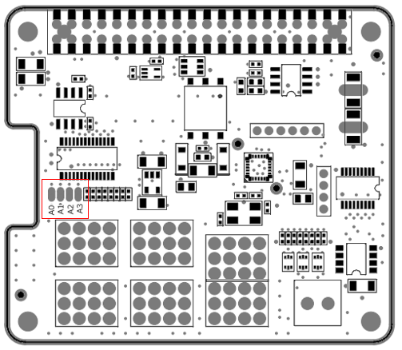
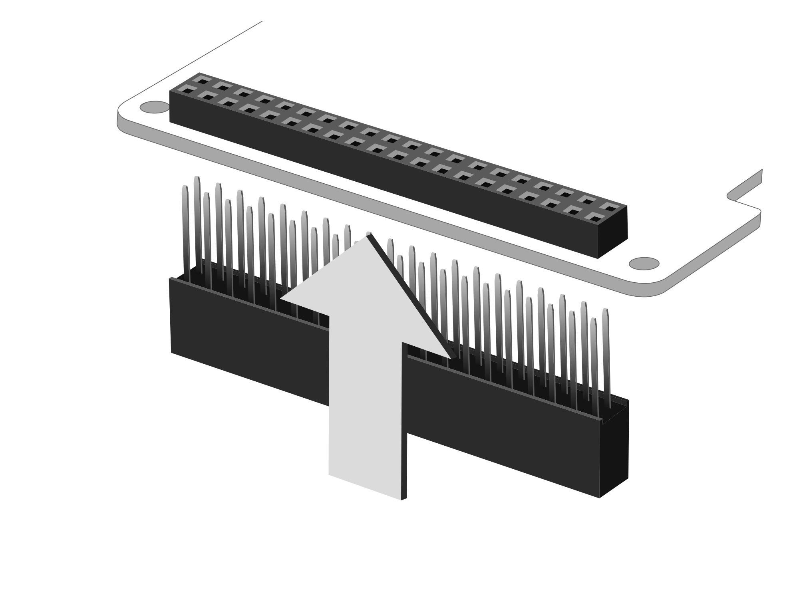
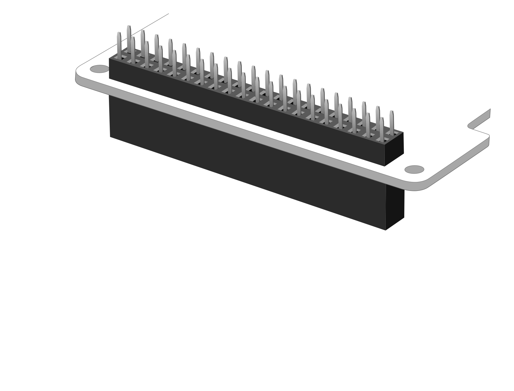
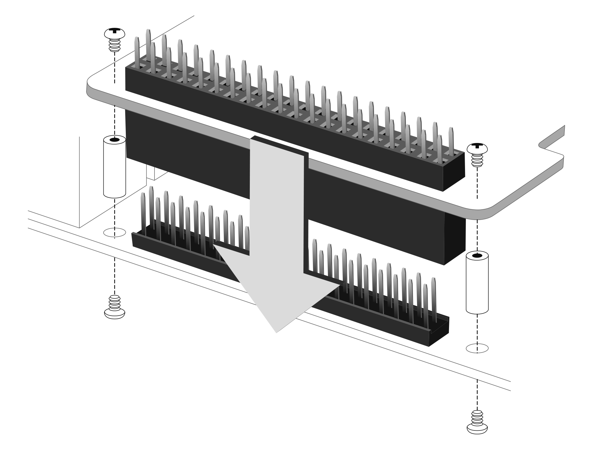

# RPi-GP90の設定と装着  
各種設定と本製品をRaspberry Pi GPIO 40PINに接続する方法を説明します。  

___  
## 1. 各種設定  
  
### 1-1. I2Cアドレスの設定  
PWMコントローラPCA9685のI2Cアドレスを、半田ジャンパ(A0, A1, A2, A3)のオープン/ショートによって設定変更できます。  
※初期設定は`0x40`(A0～A3オープン)です。  

|A3|A2|A1|A0|I2Cアドレス||
|:--:|:--:|:--:|:--:|:--:|:--:|
|Open|Open|Open|Open|0x40|※初期設定|
|Open|Open|Open|Short|0x41||
|Open|Open|Short|Open|0x42||
|Open|Open|Short|Short|0x43||
|Open|Short|Open|Open|0x44||
|Open|Short|Open|Short|0x45||
|Open|Short|Short|Open|0x46||
|Open|Short|Short|Short|0x47||
|Short|Open|Open|Open|0x48||
|Short|Open|Open|Short|0x49||
|Short|Open|Short|Open|0x4A||
|Short|Open|Short|Short|0x4B||
|Short|Short|Open|Open|0x4C||
|Short|Short|Open|Short|0x4D||
|Short|Short|Short|Open|0x4E||
|Short|Short|Short|Short|0x4F||
___  
## 2. 本体の組み立て  
製品付属の40PIN ピンヘッダーを本製品の底面より垂直に装着します。  
※40PINのピンヘッダーの先端は尖っていますので、怪我には十分ご注意ください。  

  

  

## 3. Raspberry Piボードとの接続  
Raspberry Pi 本体のGPIO ピンヘッダと本製品を接続します。  
スペーサー（付属）を本製品本体のネジ穴にあわせ、スペーサーを付
属のネジ（4 本）で固定し、そのままRaspberryPi のGPIO ピンへ垂
直に差し込みます。  
スペーサーがRaspberryPi 基板に合わされば接続は完了です。  
あとはRaspberryPi の背面より付属のネジ（4 本）を使用し、スペーサーを固定します。    
※反対側にも同じようにスペーサーとネジを使用し本体を固定してください。  

  
